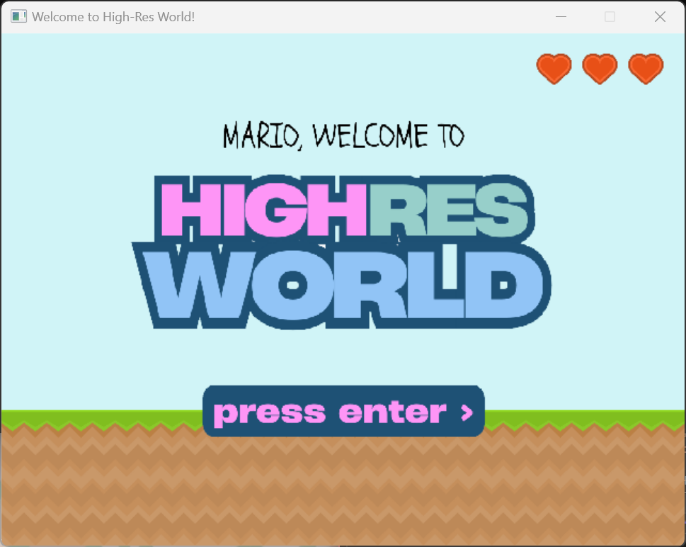
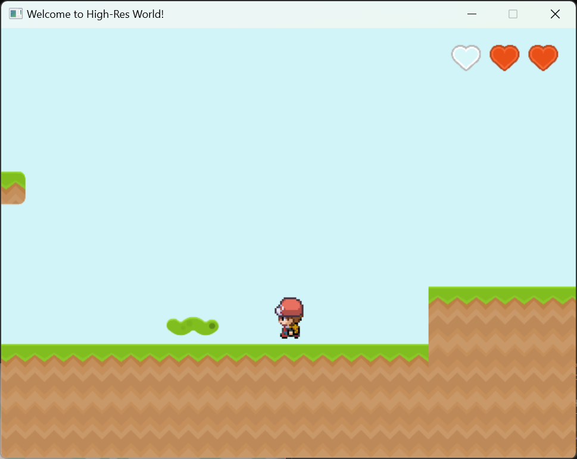
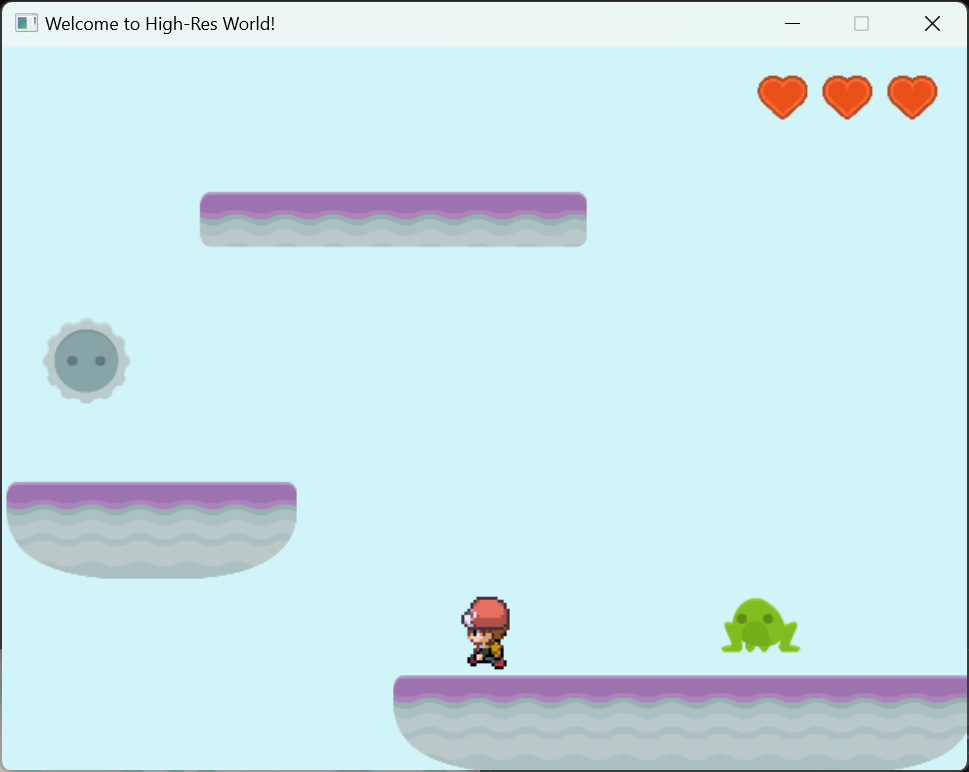
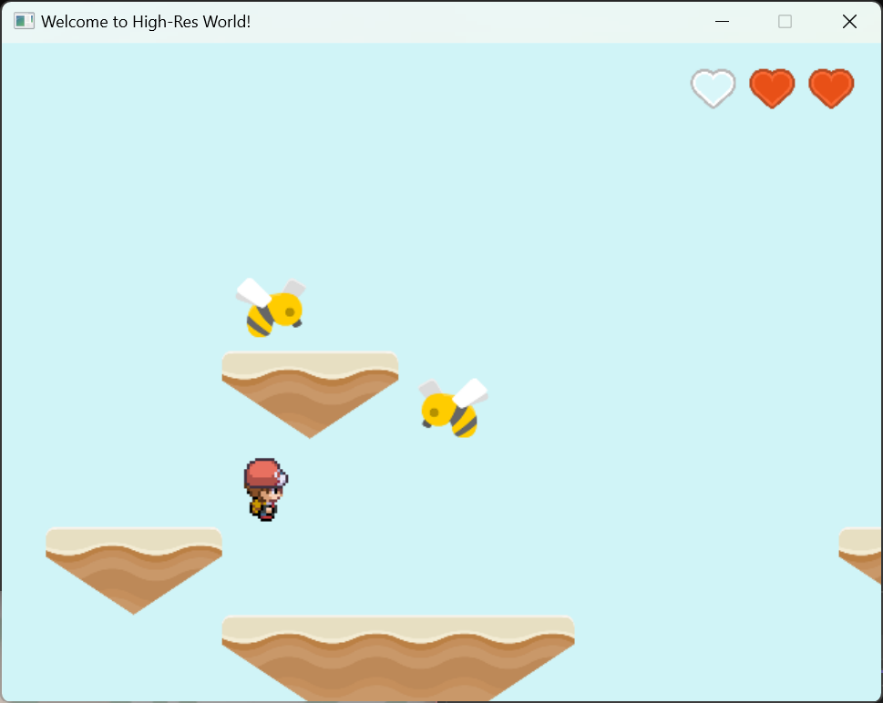

# Mario, Welcome to High-Res World 🌟

> *A pixel Mario embarks on a journey through a high-resolution vector art world.*

---

## 🎮 Game Overview

**Mario: Welcome to High-Res World** is a 2D platformer where classic pixel-style Mario finds himself in a vibrant, vector-art world full of unfamiliar dangers. Your goal is to guide Mario through all **3 levels** while avoiding enemies and environmental pitfalls. If you reach the final level without losing all your lives, you win. If you fall or collide too many times, it’s game over.

---

## 🕹️ Controls

- **Arrow Keys**: Move Mario
- **Space Bar**: Jump

---

## 🗺️ Levels & Enemies

### 🧩 Level A (Stage 1)

- **Theme**: Entry into the High-Res world.
- **Enemy**: A **guard-type worm** that chases Mario when approached.

---

### ⚙️ Level B (Stage 2)

- **Theme**: Mechanized obstacle zone.
- **Enemies**:
  - A **falling saw blade** that acts as an obstacle.
  - A **jumping frog** with simple AI movement.

---

### 🐝 Level C (Stage 3)

- **Theme**: High-flying danger.
- **Enemies**: Two **flying bees** that follow Mario through the air using sine wave movement.

---

## ❤️ Lives System

- You start with **3 lives**.
- **Lose a life** if:
  - You fall off the platform.
  - You collide with an enemy.
- **Win the game** by reaching the goal in Level C with at least one life.
- **Lose the game** if all lives are lost.

---

## 📦 Assets Used

- Pixel-style Mario spritesheet  
- High-resolution vector-style platforms and enemies  
- Sound effects: Jump, Game Over, Bling  
- Background music per level  

---

## ✨ Theme & Concept

This game explores the theme of **contrast** — the nostalgic **pixel art** of Mario set against the clean, **high-res vector world**. It visually highlights the feeling of being out of place in a strange environment, while blending both old and new aesthetics.

---

Enjoy the adventure and survive the high-res chaos!
